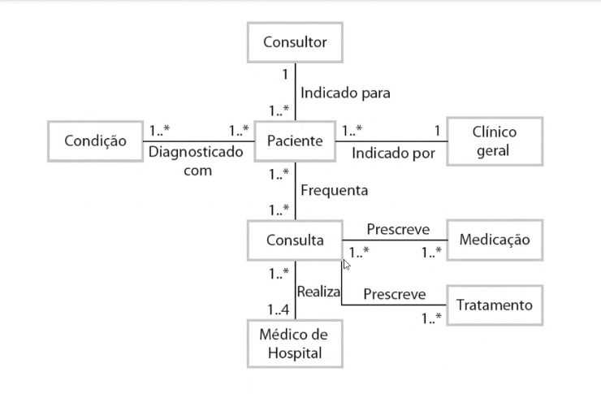
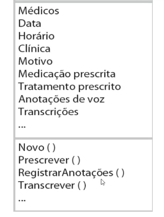

# Aula 1

- Regra de negocio

---------------------------------------;

Modelagem de sistemas

A modelagem de sistema é o processo de desenvolvimento de modelos abstratos de um sistema, de maneira que cada modelo apresenta uma visão ou perpectiva diferente do sistema

Atualmente, a modelagem de sistema se tornou a representação de um sistema usando algum tipo de notação gráfica, que hoje em dia quase sempre são baseadas em notações em Unified Mode ling Language (UML).

A modelagem de sistema ajuda o analista a entender a funcionalidade do sistema e os modelos são usados para comunicação com os clientes.

# Modelos de sistemas existentes e planejados

Os modelos de sistemas existentes são usados durante a engenharia de requisitos.Eles ajudam a esclarecer o que o sistema existe faz e podem ser usados como uma base para discussão do seus pontos fortes e fracos.

Os modelos de um novo sistema são usados durante a engenharia de requisitos para ajudar a explicar os requisitos propostos para outros StakeHolders dos sistema,.

Os engenheiros usam esses modelos para discutir propostas de projeto e para documentar o sistema para implementação

## Pespectivas de sistema

Uma pespectiva externa, na qual você modela o contexto ou ambiente do sistema.

Um pespectiva de interação em que você modela as interações entre um sistema e seu ambiente ou entre os componentes de um sistema.

Uma perpesctiva comportamental, em que você modela o comportamento dinâmico do sistema e como ele responde a eventos.

Uma perspectiva comportamental, em que você modela o comportamento dinâmico do sistema e como responde a eventos.

## Tipos de diagramas UML

Os diagramas de atividades, mostram as ativades envolvidas em um processo ou no processamento de dados.

Os diagramas de casos de uso, que mostram as interações entre um sistema e seu ambiente.

Os diagramas de sequÊncia, que mostram as interações entre os atores e o sistema e entre os componentes do sistema.

Os diagramas de classe, que mostram as classes de objeto no sistema e as associações entre as classes.

Os driagramas de estado, que mostram como sistema reage a enventos internos e externos.

## Uso de modelos gráfico

Como forma de facilitar a discussão sobre um sistema existente ou proposto

Os modelos incompletos e incorretos podem ser usados já que serve para auxiliar a discussão.

Como uma forma de documentação já existente.

Os modelos devem ser uma representação precisa do sistema, mas não precisam estar completos.

Como uma descrição detalhada do sistema, a qual pode ser usada para gerar uma impletamentação do sistema

- Os modelos precisam e estar corretos e completos.

# Modelos de contexto

Os modelos de contexto são usados para ilustrar o contexto operacional de um sistema - eles mostram o que existe fora dos limites do sistema.

Interesses sociais e organizacionais podem afetar a decisão de onde posicionar os limites do sistema.

Modelos de arquitetura mostram o sistema e seu relacionamento com outros sistemas.

## Limites do sistema

Os limites do sistema são estabelecidos para definir o que está fora do sistema

- Eles mostam outros sistemas que são usados ou dependem do sistema que está sendo desenvolvido

A posição do limite do sistema tem um efeito profundo nos requisiitos do sistema.

## O Contexto do MHC-PMS

## Modelo de processo

# Modelos de interação

A modelagem de interação do usuário é importante por auxiliar a indentificar os requisitos do usuário.

Modelar a interação sistema-a-sistema destaca os problemas de comunicação que possam vir a surgir

Modelar a interação de componentes auxia a entender se uma estrutura proposta de sistema pode fornecer um desemprenho e uma confiança do sistema

Os diagramas de caso de uso e os diagramas de sequeência podem ser usados para modelagem de interação.

Os diagramas de caso de uso e os diagramas de sequencia podem ser usados para modelagem de interação

- Modelagem de caso de uso

  - Os casos de uso foram desenvolvidos originalmente para auxiliar na elicitação de requisitos e atualmente, estão incorporados na UML

  - Cada caso de uso representa uma tarefa distinta que envolve interação externa com um sistema

  - Os atores em um caso de uso podem ser pessoas ou outros sistemas.

  - São representados esquematicamente para fornecer uma visão geral do caso de uso e em uma forma textual mais detalhada.

## Diagramas de sequencia

Os diagramas de sequencia são parte da UML e são usados que ocorrem durante um caso de uso em particular ou uma instancia de caso uso.

Os objetos e os atores envolvidos são listados na parte superior do diagrama com uma linha pontilhada desenhada verticalmente a partir deles.

As interações entre os objetos são indicadas por setas anotadas.

- Identificação – Principalmente número (PID) de identificação e do processo ou usuário (UID) que o criou.

Diagrama Sequencia Transferencia Dados

# Modelos estruturais

Modelos estruturais de software mostram a organização de um sitema em termos de seus componentes que compoem este sistema e seus relacionamentos.

Os modelos estruturais podem ser modelos estáticos, que mostram a estrutura do projeto do sistema, ou modelos dinâmicos, que mostram a organização do sistema quando ele está em execução.

Você cria modelos estruturais de um sistema quando se está discutindo

## Diagramas de classe

Os diagramas de classe são usados quando se está desenvolvendo um modelo de sistema orientado a objetos para mostrar as classes em um sistema e as associações entre as classes

Uma classe de objeto pode ser consideraca como uma definição geral de um tipo de objeto do sistema.

Uma associação é uma ligação entre classes que indica que há algum relacionamente entre essas classes.

Quando se está desenvolvendo os modelos durante os primeiros estágios do processo de engenharia de software.

Classes e associação em UML

A classe Consulta

# PONTOS IMPORTANTES

# Hierarquia de generalização

# Modelos comportamentais

- Os modelos comportamentais são modelos do comportamento dinamico do sistema enquanto esse está em execução. Eles mostrtam o que acontece ou o que deveria acontecer quando um sistema responde um estilo de seu ambiente
